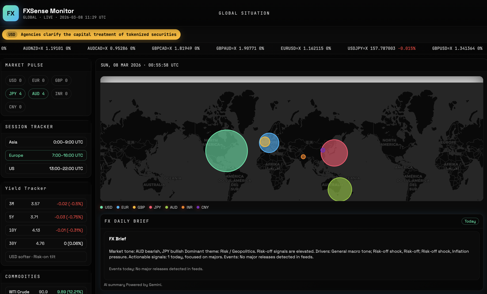
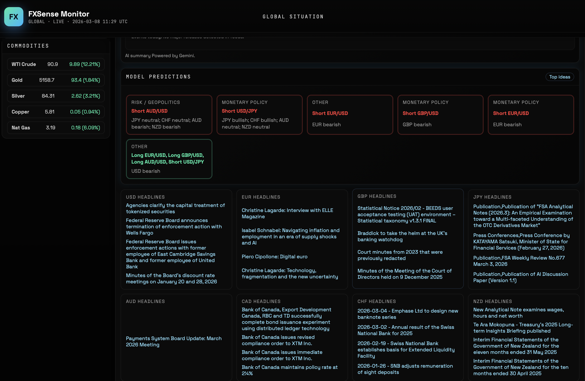
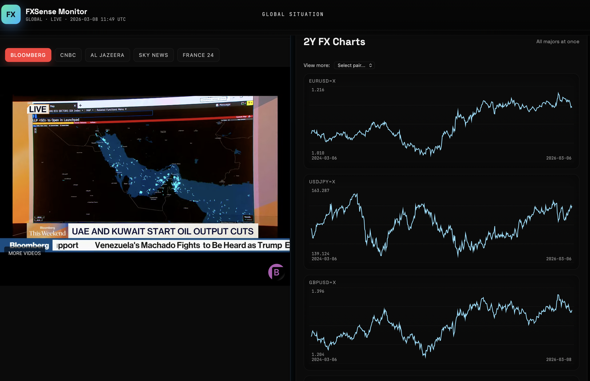
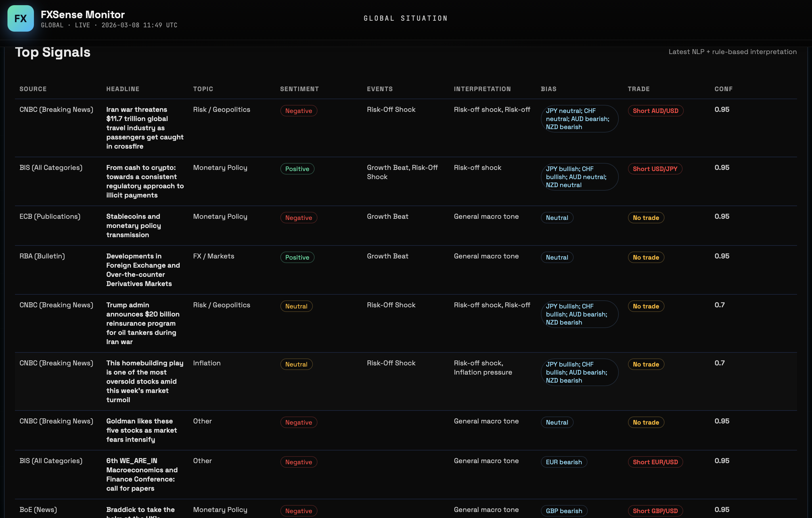

# FXSense — Live FX Intelligence (Hackathon MVP)

FXSense is a lightweight FX market intelligence and trading signal engine. It scrapes public sources, runs NLP, generates interpretable FX signals, and serves a live dashboard with FX prices, news, yields, and model recommendations.

This is built to be **fast, demo‑friendly, and local‑first** for a 24‑hour hackathon.

## What It Does

- **Scrapes** public central‑bank pages and RSS feeds (Fed, ECB, BoE, BoJ, BIS, RBA, CNBC, etc.)
- **Normalizes** headlines and timestamps and removes duplicates
- **Analyzes text** with sentiment + topic + event detection
- **Generates FX trade signals** (rule‑based, interpretable)
- **Live dashboard** with:
  - FX price ribbon
  - World FX signal map
  - FX Daily Brief
  - Model Predictions (trade cards)
  - Country headlines
  - Commodities
  - Live news streams (Bloomberg default)

## Screenshots

### Overview


### Model Predictions + Headlines


### Live News + FX Charts


### Top Signals Table


## Project Structure

```
fxsense/
  README.md
  app.py                # legacy streamlit app (not used)
  data/                 # CSV outputs (ignored by git)
  scrapers/
    scrape_sources.py
  nlp/
    analyze_text.py
  signals/
    generate_signal.py
  utils/
    gemini_client.py
    return_logit.py
  webapp/
    main.py             # FastAPI backend
    templates/
      index.html
    static/
      style.css
      app.js
```

## Quickstart

### 1) Create and activate a venv

```bash
cd fxsense
python3 -m venv .venv
source .venv/bin/activate
```

### 2) Install dependencies

```bash
pip install -r requirements.txt
```

### 3) (Optional) Add Gemini API Key

Create `fxsense/.env`:

```
GEMINI_API_KEY=YOUR_KEY
GEMINI_MODEL=gemini-2.5-flash
```

Gemini is used to generate the FX Daily Brief. If not set, the brief falls back to a rule‑based summary.

### 4) Run the data pipeline

```bash
python3 scrapers/scrape_sources.py
python3 nlp/analyze_text.py --input data/scraped_latest.csv --output data/analyzed_latest.csv
python3 signals/generate_signal.py --input data/analyzed_latest.csv --output data/signals_latest.csv
```

### 5) Start the web app

```bash
python3 -m uvicorn webapp.main:app --reload --port 8001
```

Open:

```
http://127.0.0.1:8001
```

## Live Data Notes

- FX prices are pulled from Yahoo Finance and refresh every ~60s.
- News feeds refresh every few minutes and are cached.
- Live video streams are loaded from YouTube (Bloomberg default).

## FX Signals — How It Works

Signals are built from:

- **Sentiment**: positive / neutral / negative
- **Topics**: monetary policy, inflation, growth, risk/geopolitics
- **Events**: rate hikes/cuts, inflation surprises, risk‑off shocks

The signal engine maps these to **currency bias** and **trade suggestions** (e.g., “Hawkish Fed → USD bullish → Short EUR/USD”).

Rules are transparent and fully editable in:

```
signals/generate_signal.py
```

## Optional: Return Logistic Model

FXSense includes a lightweight statistical model that tries to predict **1‑day signal success**.

### Step 1: Log signals

```bash
export SIGNAL_LOG=1
export SIGNAL_LOG_PATH="data/signal_log.csv"

python3 signals/generate_signal.py --input data/analyzed_latest.csv --output data/signals_latest.csv
```

### Step 2: Train logistic model

```bash
python3 utils/return_logit.py --log data/signal_log.csv --out data/return_logit_metrics.csv
```

Outputs:

- `data/return_logit_metrics.csv` with accuracy/precision/recall/AUC
- `data/return_logit_metrics.pkl` (model)
- `data/return_logit_metrics.json` (feature columns)

### Step 3: Score signals

```bash
export MODEL_SCORE=1
python3 signals/generate_signal.py --input data/analyzed_latest.csv --output data/signals_latest.csv
```

If Yahoo returns no price data (weekends/future dates), the model won’t have labeled samples.

## Configuration

Environment variables:

```
GEMINI_API_KEY=...           # optional
GEMINI_MODEL=gemini-1.5-flash
SIGNAL_LOG=1                 # enable signal logging
SIGNAL_LOG_PATH=data/signal_log.csv
MODEL_SCORE=1                # score signals with logistic model
RETURN_LOGIT_MODEL=data/return_logit_metrics.pkl
RETURN_LOGIT_COLS=data/return_logit_metrics.json
```

## Troubleshooting

**1) No data or empty panels**
- Run the pipeline steps (scrape → analyze → generate).

**2) Live prices missing**
- Yahoo can return empty data during downtime or for specific tickers. Try again in a few minutes.

**3) Reuters/Al Jazeera not live**
- If the channel isn’t live, the player will show fallback.

**4) Gemini brief is too short**
- Ensure `GEMINI_API_KEY` is set in `.env`. Restart app.

## Disclaimer

This is a **hackathon MVP** and for educational/demo use only. Not financial advice.

1
